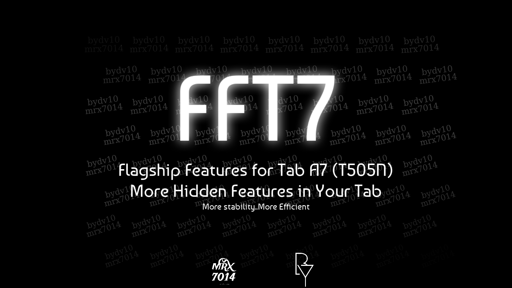

### FFT7 - Flagships Features for Tab A7

  
**A Magisk Module To Enable Samsung Flagships Features on Samsung Tab A7**

**Working on Stock Rom Only**

 

# V1.0.0 Released

### ✨️Features:

⚙️System:
- High-End Animations
- Performance Profile
- Processing Speed
- Better Responsiveness & Speed
- Smooth UI & Scroll
- Reduce Lags
- Save Battery Without Performance Drop
- Dolby Atmos without Headsets
- Dolby Atmos in Games
- Dolby Atmos Game Profiles
- Flagship Edge Ligthining+
- Multi Users
- Screen Recorder
- Camera Tweaks
- Faster streaming videos
- Disables built in error reporting
- Disables logcat
- Vulkan as default rendering driver
- Disable Locating
- Safetynet (Maybe not working well)
- Enhanced CPU Responsiveness
- Samsung Galaxy S24 Boot Animation
- OneUI 7 Sounds
- Spoofing to Tab S10 Ultra (Based On MRX7014's Module)
- Enable more Screen recorder features

### ⚙️ Installation:
1. Download the module from the releases
2. Open the Magisk/KernelSU app and go to modules
3. Click the "Install from storage" button and select the .zip you just downloaded
4. Done, Reboot

### 🪲 Known bugs
- Please report here or in Telegram, if you find any

 

# Credits:

<a href="https://t.me/mrx7014">**MRX7014**</a>
___
<a href="https://t.me/bydv10">**Belal Youseef**</a>
